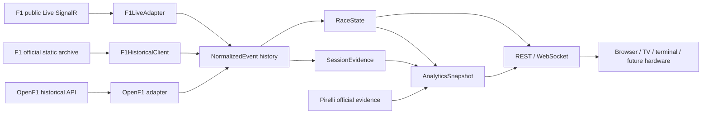

# Architecture

Slipstream is a historical replay, public live-timing, and deterministic race-intelligence application. Replay and proven public live topics both enter the canonical `NormalizedEvent` → `RaceState` pipeline; raw public capture remains optional evidence, while canonical normalized events are the product recording.

## System shape



```text
Direct OpenF1 CLI capture path

OpenF1 HTTP responses
        |
        v
versioned raw recording ---> OpenF1 adapter ---> normalized events
                                                    |
                                                    v
                                               RaceState reducer
                                                    |
                                  +-----------------+-----------------+
                                  |                 |                 |
                           replay controller    terminal          API v1
                                                                      |
                                                               browser pit wall

Metadata path

OpenF1 sessions/meetings ---> lightweight catalog ---> session library
                                      |                      |
                               dates + circuits       local recordings overlay

Race-intelligence path

Pirelli baseline + Static/circuit facts + RaceState + SessionEvidence
                    + same-meeting WeekendContext v1
                    + optional, separately labelled External Intelligence
                                      |
                                      v
                          cached AnalyticsSnapshot v1
                     /api/v1/analytics + replay stream

Public live path

public F1 SignalR ---> F1LiveAdapter ---> shared ordered NormalizedEvent history
                         |                     |                 |
                         |                     |                 +--> atomic normalized replay
                         |                     +--> per-viewer delayed RaceState + AnalyticsSnapshot
                         \-> optional versioned raw JSONL evidence
```

`PublicLiveSession` owns at most one upstream connection, verifies the provider session key, maintains sparse provider state inside `F1LiveAdapter`, and publishes only canonical events/state. Every viewer derives `RaceState` and `AnalyticsSnapshot` at the same private delayed cursor. Schedule activity, transport health, product lifecycle, and replay availability are separate states.

## Core invariants

1. `RaceState` is the canonical current factual state; calculated analytics remain a separate versioned sidecar.
2. Provider payloads are translated by adapters before reaching state or transports.
3. State reduction is deterministic and independent of HTTP, WebSocket, and UI concerns.
4. Each replay viewer owns an independent cursor and clock.
5. One instance owns no more than one upstream live connection.
6. Capabilities describe available data; consumers do not branch on provider names.
7. Public and authenticated capabilities remain separate.
8. Recordings are inputs and operational evidence, not the public API contract.

## Components

| Component | Responsibility |
| --- | --- |
| `adapters/openf1.py` | Acquire historical endpoint data and translate supported recordings into normalized events |
| `catalog.py` | Cache recent session metadata and circuit geometry without timing data |
| `library.py` | Merge catalog entries with local recordings and lazily load the selected session |
| `events.py` | Define normalized event envelopes and timestamp parsing |
| `state.py` | Apply current factual events to immutable, lightweight `RaceState` snapshots |
| `evidence.py` | Reconstruct queryable source-neutral session/lap evidence by replay time or cursor |
| `session.py` | Normalize discovered session labels into `SessionKind` and `LayoutFamily` |
| `weekend.py` | Prepare and cache compact meeting context asynchronously under `/data/.slipstream` |
| `analytics.py` | Orchestrate cached, cursor-safe Strategy, RaceRead, driver, and Battle analytics with provenance |
| `qualifying.py` | Author cursor-safe phase, clock, benchmark scope, verified advancement boundary, final segment results, teammate comparison, and lap-history intelligence |
| `pirelli/` | Discover, archive, deterministically extract, validate, and cutoff-admit official Pirelli pre-race evidence |
| `published_strategy.py` | Author stop-preserving actual tyre strategies and compare them with admitted Pirelli options/windows |
| `race_intelligence.py` | Own explicit race-phase comparability, TO_FINISH evidence, field distributions, RaceRead, and hard projection invariants |
| `strategy_rules.py` | Hold narrow season/session rule profiles without applying current rules to unverified historical events |
| `external.py` | Define the optional external-intelligence boundary, disabled by default |
| `replay.py` | Load supported recordings and reconstruct state deterministically |
| `playback.py` | Own replay cursor, source clock, seek, delay, pause, and play behavior |
| `api.py` | Expose API v1, per-client WebSocket playback, downloads, and compiled browser files |
| `live.py` | Normalize the proven public subset through one reconnecting upstream and own the product-facing lifecycle |
| `live_recording.py` | Append canonical live events to an in-progress artifact and atomically expose the finalized replay |
| `terminal.py` | Render canonical state for command-line inspection |
| `web/` | Typed API/WebSocket clients, session context, shared factual panels, and Race/Qualifying/Practice views; never read a provider directly |

## Canonical state

`RaceState` is an immutable snapshot with schema version 1. Its main children are:

- `session`: identity, official time window, lap/total race laps, qualifying phase/clock, local time, status, and whole-track state
- `circuit`: exact ordered outline, display rotation, provenance, and availability
- `weather`: observation time, temperatures, humidity, pressure, rain detection, and wind
- `drivers`: identity, classification, timing, tyre/stint and NEW/USED evidence, sectors, source-observed activity, terminal lifecycle, final Qualifying segment facts, estimated progress, optional source X/Y, field availability, and current factual values
- `race_control`: ordered messages with track, sector, driver, and lap scope where provided

Every event produces a new snapshot. Seeking resets the reducer and reapplies all events through the inclusive target time or cursor. This is intentionally simple and deterministic; checkpointing can be added later without changing the state contract.

Full lap history is not part of `RaceState`. `SessionEvidence` reconstructs append-only normalized lap observations from the same deterministic event stream and supports queries by replay timestamp or event cursor. Observations retain duration, sectors, compound/stint context, tyre age, pit-in/out evidence, and quality reasons without being retransmitted in every state snapshot. Strategy and representative-pace calculations will consume this sidecar in tested backend logic; they do not belong in `RaceState` or a parallel frontend truth model.

`WeekendContext` is a separate artifact strictly scoped to the selected session's `meeting_key`. It contains only compact normalized evidence from earlier sessions in that same meeting ending at or before the explicit `evidence_cutoff`; it never contains another race weekend, a prior edition at the circuit, or the selected Race's later laps/results. Static circuit facts and optional External Intelligence remain separately labelled inputs. Full replay recordings remain session-scoped. Missing context is prepared in a serialized background task, while replay starts immediately and Strategy progresses from baseline to weekend model to in-session outlook.

Eligible sessions are discovered rather than assumed. A standard weekend may progressively contribute FP1, FP2, FP3, and Qualifying evidence before the Grand Prix; a Sprint weekend may contribute FP1, Sprint Qualifying, Sprint, and Qualifying evidence. Only sessions actually present, completed before the cutoff, and carrying the same `meeting_key` are admitted.

`AnalyticsSnapshot` is synchronized to the replay or delayed-live cursor/time and cached by meaningful factual and context revisions. Legacy `raceStrategy` and per-driver projection fields remain on the version-1 wire for compatibility, but M3.5 product surfaces do not consume them. Strategy/Session/Driver/TV render server-authored factual `raceRead` plus the separately admitted Pirelli published baseline. Each retained analytical metric is `OBSERVED`, `DERIVED`, `ESTIMATE`, or `UNKNOWN` and carries its evidence basis, model version, and evidence/sample quality where useful. The clean-lap pace baseline is the median of at least three representative laps in a stint after median-absolute-deviation filtering; contaminated, pit, and neutralized laps remain visible but do not move that baseline.

Prior-season `HistoricalContext` and attributed `OfficialPreRaceContext` are optional sidecars, distinct from same-meeting `WeekendContext`. `OfficialPreRaceContext` now carries the lossless admitted Pirelli baseline used by `publishedStrategy`; legacy two-slot fields remain compatibility-only. Deterministic archived-session backtesting remains unimplemented and publishes no sample metrics.

One application-owned `PirelliRuntimeCoordinator` remains the fastest path for relevant current meetings and never runs from a browser request path. Discovery uses the official event category (`<season> <canonical meeting name>`) rather than weakening alias-match acceptance: global Formula 1 RSS is followed, when insufficient, by the exact event archive and exact event/tag RSS. Planned pre-weekend, post-session, race-morning, final-pre-race, and post-race triggers are supplemented by startup recovery for missing/stale evidence; a failed attempt is logged, exposed in coordinator state, and retried after 30 minutes without advancing success time. Separately, startup validates and idempotently imports the bundled normalized `slipstream.pirelli.seed.v1` artifact, then a single-concurrency historical coordinator quietly attempts one missing meeting at a time. Its private OpenF1 meeting/session metadata cache uses the shared validated 10-season default and is intentionally independent of the browser catalog horizon. Historical repair applies the current normalizer to local immutable source material before network acquisition. Historical failures are persisted with retry times and never block or starve the current coordinator, API, live timing, or replay. Maintainer-only re-normalize/refresh/build commands produce the bundled seed; normal startup never builds it or scrapes the full horizon.

Raw responses and normalized releases live below `/data/.slipstream/pirelli/<meeting_key>/`; the distribution seed contains normalized facts and provenance only, never article bodies or raw HTML/PDF/image data. Admission requires the exact meeting, target session, Race/Sprint scope, and evidence cutoff; WEEKEND nominations may be reused only within that meeting. Content retrieved after the cutoff is admitted only when source metadata proves that exact artifact version existed by the cutoff, and an attached child artifact cannot borrow its parent page's version proof. Missing publication, extraction, native-PDF tyre bank, or writable storage produces an explicit absent baseline and never blocks replay. The production image installs the native-text `pypdf` extra; OCR, image-table parsing, and VLM/LLM extraction remain absent.

`PirelliEvidenceStore` first attempts strict model admission. If exact version proof is unavailable, it may admit a separately labelled `DISPLAY_ONLY_OFFICIAL_HISTORICAL` baseline only when the artifact comes from an approved official Pirelli host, has correct meeting/session scope, and has a known pre-cutoff publication time. That tier is exposed as `PUBLISHED PRE-RACE · ARCHIVED LATER`, sets `modelAdmissible: false`, and cannot create model-comparable options or future windows.

`publishedStrategy` is authored in `published_strategy.py`. It preserves every Pirelli option and its ranking/order. The legacy distinct-compound relation/window fields remain on API v1 for compatibility. The additive `actualStrategy` is reconstructed from cursor-scoped normalized pit events, preserves every stop including consecutive same-compound stops, reconciles its evidence against the factual pit count, and retains unknown compound slots instead of inventing them. Model-admissible per-option `pirelliReferences` compare factual stop laps with published bounds and author `STILL_APPLICABLE`, `ALIGNED`, `SAME_COMPOUNDS_DIFFERENT_TIMING`, `SAME_COMPOUNDS_TIMING_UNKNOWN`, `EXTRA_SAME_COMPOUND_STOP`, `NO_MATCH`, `NOT_COMPARABLE`, or `UNKNOWN`; display-only options are `REFERENCE_ONLY` and deliberately carry no timing comparison. React renders this contract, the server-owned dry-tyre requirement, and shared compound badges; it never selects or calculates a strategy.

The normative derivation reference is [docs/analytics.md](docs/analytics.md). It records the current formulas, evidence thresholds, quality rules, replay-time behavior, Battle Score weights, and limitations that require `UNKNOWN`.

RaceRead is the single server-authored field interpretation: it separates starting from current tyres, counts factual lifecycle populations, summarizes current-race Pace Trend, stint context, recent pits, and the authoritative dry-rule population. Future strategy fields are published only when hard validity, plausibility, and three-completed-lap stability gates pass. Battle stabilization and histories are derived from completed-lap source evidence, never request order or 250 ms transport snapshots.

Sporting-rule facts are versioned by season and session kind. The 2026 profile follows the [FIA 2026 Formula 1 Sporting Regulations, Section B, Issue 08](https://www.fia.com/system/files/documents/fia_2026_f1_regulations_-_section_b_sporting_-_iss_08_-_2026-08-05_7.pdf). Sprint never inherits Grand Prix stop assumptions, and historical/event-specific obligations remain unknown until a matching profile exists.

## Browser architecture

The Vite application has a thin entry page. `web/api` owns versioned HTTP and WebSocket transport, `web/domain` owns canonical TypeScript contracts, session classification, appearance, and layout resolution, and `web/hooks` coordinates one selected replay resource plus device-local presentation preferences. The global product shell exposes Session, Driver, Battle, TV Mode, and My Settings. Race, Qualifying, and Practice remain shared layout families; Driver Focus opens from navigation, a driver picker, or a timing row. Practice 1/2/3, Qualifying, Sprint Qualifying, Sprint, and Grand Prix remain distinct session kinds without becoming separate applications.

The Race view alone owns the draggable Timing-to-Analysis split and its Balanced, Tower Wide, and Analysis Wide presets. Separate Standard, Timing, and Strategy Timing Tower modes change content rather than width. Analysis modules resolve through the `Instance default -> User preference -> Device override` layout model and can be reordered, resized, or hidden. Qualifying and Practice have authored layouts rather than inheriting that divider. Responsive session layouts are re-authored for portrait and landscape instead of scaling desktop columns. Stable session/source capability decides whether a whole column exists; an unavailable row value inside a supported column renders `—`. Raw capability enums are not promoted into dense product UI.

Qualifying renders the server-authored `qualifying` analytics contract: factual phase/session clock, a segment benchmark when phase is known or session-wide benchmark when it is not, verified advancement boundary, explicit final-segment elimination, tyre usage, teammate comparison, and cursor-safe completed-lap history. Stable roster metadata—not the number of rows currently visible—selects the verified advancement profile. Qualifying Driver Focus never substitutes Race pit/Pirelli panels. Qualifying TV has only Tower plus Track when actual or accepted approximate car positions are renderable; Practice TV is Tower-only.

Driver Focus requests normalized lap evidence on demand from `/api/v1/driver-history`; full history never returns to the high-frequency state snapshot. Driver, Battle, Race Strategy, and TV consume the same backend analytics sidecar. Device-local TV rotation, Driver target, Battle mode, appearance, and layout settings use browser storage; user and instance persistence wait for the authenticated control plane.

## Catalog and replay library

The catalog and recordings solve different problems:

- `catalog.json` supplies season/weekend/session discovery, dates, local offsets, and circuit outlines.
- Recording JSON supplies timing and replay events for one session.

`ReplayLibrary` overlays local recordings on catalog descriptors. It normalizes only the selected recording and caches only that selected resource. A catalog-only session produces a small placeholder state so the UI can show its date, circuit, download status, and live schedule window without inventing timing.

When more than one local timing artifact exists for a session, selection is explicit and whole-session: finalized canonical Live (`f1-signalr-public`) precedes official static archive (`f1-static-public`), which precedes OpenF1. Filename order never selects a source and timing facts are never mixed. Catalog circuit geometry and Pirelli remain separately scoped durable inputs.

Browser/API historical download attempts official F1 static reconstruction before OpenF1. The outer prefix of each F1 `.jsonStream` row is provider SessionTime, not elapsed time from the scheduled session start. `F1HistoricalClient` establishes stream zero from a consensus of provider UTC anchors in `ExtrapolatedClock` and `SessionData`, with a 10 ms cluster tolerance and at least 75% agreement. Missing or inconsistent anchors fail the official reconstruction closed, causing a whole-session OpenF1 fallback rather than a partial blend. Direct `slipstream fetch`, `fetch-weekend`, and `fetch-season` commands remain OpenF1-specific.

Deleting a replay removes only rebuildable session timing/raw/context artifacts. It preserves catalog/session metadata, circuit geometry, immutable Pirelli evidence, and the small source manifest so the session stays visible and redownloadable.

The default session is the currently active scheduled session when one exists. Otherwise it is the newest locally available recording, falling back to the newest catalog entry.

## Track and car position

Circuit shape and car position are separate capabilities:

- `circuit_shape` means an exact ordered historical outline is available.
- `positions` means timing supports an approximate lap-progress value.
- `location_xy` means source X/Y samples are present for drivers.

A normal historical recording maps timing-derived progress onto the circuit outline. A recording fetched with `--include-location` prefers source X/Y per driver and falls back to that driver's retained timing progress when an X/Y update is sparse. Sparse updates never erase another driver's last factual position. These coordinates are still source observations and should not be described as precise lateral racing-line telemetry.

If neither timing progress nor X/Y is available, the circuit remains visible and the UI explains why cars cannot be placed.

## Replay transports

REST endpoints expose catalog metadata, final normalized state, capabilities, replay bounds, and historical download operations. The WebSocket owns interactive replay:

```text
browser connection
    |
    +-- private ReplayController
    +-- private cursor/playhead
    +-- private speed and delay
    `-- shared immutable recording/event history
```

One viewer seeking or applying a broadcast delay does not move another viewer. Playback advances in source-clock batches rather than sending a snapshot for every upstream event.

Routes and message compatibility are defined in [docs/protocol.md](docs/protocol.md).

## Live-source boundary

`PublicLiveSession` owns one reconnecting unauthenticated SignalR connection for the currently scheduled session. `F1LiveAdapter` keeps SignalR framing/session verification at the boundary and rejects a provider session whose `SessionInfo.Key` differs from the selected catalog session. Official static history owns index discovery and `.jsonStream` parsing separately; both paths call the same F1 TimingData normalizer. Browser clients receive canonical API v1 snapshots, never provider payloads.

The public subscription allow-list is `DriverList`, `ExtrapolatedClock`, `Heartbeat`, `LapCount`, `RaceControlMessages`, `SessionData`, `SessionInfo`, `SessionStatus`, `TimingAppData`, `TimingData`, `PitLaneTimeCollection`, `TopThree`, `TrackStatus`, and `WeatherData`. A subscribed stream becomes product truth only where the adapter maps it to normalized events. Timestamped `SessionData.StatusSeries` contributes cursor-safe session and marshal history; `SessionData` and `ExtrapolatedClock` also provide factual Qualifying segment/clock evidence where present. `PitLaneTimeCollection` contributes bounded factual pit-lane duration only; it never supplies or stands in for stationary pit-box time. Protected GPS, car data, team radio, and other enhanced topics are not requested. Because precise X/Y is absent from the public slice and the Live product declares no car-position capability, `positionMode` is `unavailable`; the product renders the circuit but does not invent Live car locations.

Sporting state, session-control state, and marshal state are independent canonical facts. `session.status` describes `SCHEDULED`, `RUNNING`, `SUSPENDED`, `FINISHED`, or `UNKNOWN`; `control_status` carries red flag, Safety Car, VSC, VSC ending, chequered, normal, or unknown; and `marshal_status` carries all-clear, yellow, red, or unknown. The server authors `display_status` using deterministic precedence, so React never reconstructs it. Public Live can persist a red sporting state because its `SessionData.StatusSeries` supplies both suspension and explicit restart; the Dutch restart at `2026-08-23T13:33:00.088Z` returns the session to `RUNNING`. Historical OpenF1 cannot reconstruct that same bounded suspension interval because it supplies the red-flag message but no explicit actual restart. On that source the red message remains history/current evidence only; after a later marshal update the global effective badge is omitted instead of fabricating green/yellow or latching red forever. `TRACK CLEAR`, lap progress, sectors, and gaps never stand in for sporting resumption.

Transport status (`OFFLINE`, `CONNECTING`, `LIVE`, `STALE`, `UNAVAILABLE`) is internal evidence. The authoritative product lifecycle is `PRE_EVENT`, `CONNECTING`, `LIVE`, `STALE`, `RECONNECTING`, `FINALIZING`, `COMPLETE`, `REPLAY_READY`, or `UNAVAILABLE`. A disconnect never completes a session. Only explicit source completion evidence begins `FINALIZING`; every newly emitted canonical factual event extends a deterministic drain, while Heartbeat/no-op rows do not. The final canonical state remains visible, then the normalized recorder atomically renames its in-progress artifact into the ordinary ReplayLibrary format. Catalog invalidation preserves catalog identity and makes it `REPLAY_READY` without an OpenF1 download; the completed upstream is then released so a later session can take ownership. Valid same-session in-progress recordings are recovered and deduplicated after restart, while malformed or incompatible recovery fails explicitly.

At zero delay, `PublicLiveSession` serves its incrementally maintained `state` and `evidence`; it does not rebuild the full event history for every snapshot. Delayed viewers may reconstruct at their private cursor. The live WebSocket keeps one shared immutable event history and a private delay per viewer (0–300 seconds), and state plus analytics always share the same inclusive event sequence. A viewer can reset to live or select a compact delay but cannot pause, seek backward, or alter playback speed. `FINALIZING` retains the same session's last authoritative Live state while accepted late canonical events drain. When that session reaches `REPLAY_READY`, the socket sends the same session's finalized ReplayLibrary state and retires; the browser changes only its transport mode, retaining the selected session while any later live session is offered separately. The browser persists explicit session selection so a hard refresh resolves the same session across the transition. Raw versioned JSONL remains optional provider evidence and is not the replay artifact.

Driver lifecycle, provider condition, and activity are independent. F1 `Retired=true` becomes current `RETIRED_INDICATED` and can be retracted by explicit false; it does not enter the irreversible terminal guard. `Stopped=true` becomes resumable `STOPPED`, never inferred retirement. Only final classification establishes FINISHED/DNF/DNS/DSQ or an authoritative RETIRED compatibility result, and that fact appears at its source cursor rather than moving backward. M3.5 deliberately has no lap-deficit or `NO_RECENT_PROGRESS` lifecycle derivation.

## Deployment

The production image has a Node build stage and a Python runtime stage. Vite produces static browser assets; the runtime contains Python, the Slipstream package, and those assets. FastAPI serves:

```text
/                 static browser application
/api/v1/*         REST API
/api/v1/stream    WebSocket
```

There is one runtime process, one container, and one internal port (`3444`). A reverse proxy is an external deployment choice. `api-only` mode omits browser routes but keeps REST and WebSocket behavior.

## Adding another source

A new source should:

1. preserve its raw input in a versioned recording format when practical;
2. translate provider fields into normalized events inside its adapter;
3. declare capabilities explicitly;
4. keep authentication and secrets outside recordings and source control;
5. reuse `RaceState`, replay, API, and presentation layers unchanged;
6. include focused reducer/adapter tests and capability fallback tests.

Do not introduce a generic source interface merely for symmetry. Extract it when a second validated implementation demonstrates the common operations.

## Milestone boundary

M3.5 now contains historical replay, the public one-upstream live path, per-viewer delayed state plus analytics, normalized live recording/immediate replay, Race intelligence/Pirelli Strategy, and factual Qualifying intelligence and experiences. Acceptance is still a product decision; this statement describes the implemented boundary, not acceptance status.

Milestone 4 owns SQLite, first-run Admin creation, authentication/login, Viewer Profiles, persistent instance/user preferences, Storage/Data Management and retention ownership, Sync Groups, device pairing/hardware, and authenticated live-source adapters. None of those control-plane concerns may be inferred from the M3.5 browser-local preferences.

## Architecture change checklist

For changes that cross a canonical boundary, verify:

- provider fields terminate in an adapter;
- `RaceState` remains factual and lightweight;
- calculations remain in a cursor-safe `AnalyticsSnapshot` sidecar;
- replay and live derive state/analytics from the same inclusive cursor;
- source/product lifecycle and capabilities remain explicit;
- missing evidence stays `UNKNOWN`/unavailable;
- Python/TypeScript, protocol, analytics, source, README, roadmap, and tests are reconciled;
- no secrets, recordings, raw provider captures, or licensed third-party code enter Git.
