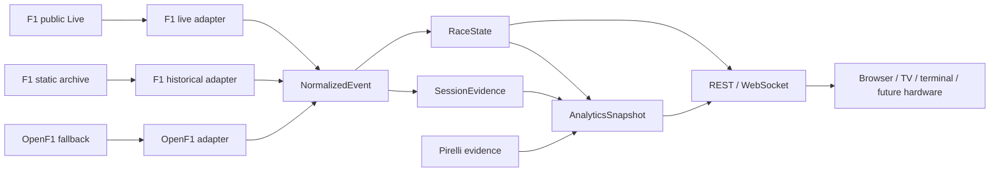

# Slipstream F1

Slipstream F1 is an open-source, self-hosted Formula 1 live-timing, historical-replay, and race-intelligence application. It normalizes source data into one deterministic event/state model, then presents that model through a browser pit wall, TV Mode, a versioned REST/WebSocket API, and a terminal renderer.

Slipstream is unofficial and unaffiliated with Formula 1, FIA, Pirelli, or any team.

## Current status

Milestone 3.5 is the source/live/replay correctness merge candidate. It establishes the factual contracts that the next visual-design pass can use without changing source truth.

| Capability | Current behavior |
| --- | --- |
| Recent-season catalog | Lightweight session/weekend metadata plus circuit geometry |
| Historical source selection | Finalized local Live replay → official F1 static reconstruction → whole-session OpenF1 fallback |
| Public live timing | One server-owned connection to the unauthenticated Formula 1 SignalR public subset |
| Canonical live recording | Normalized events finalized atomically into an immediately selectable replay |
| Historical replay | Race, Sprint, Qualifying, Sprint Qualifying, and Practice |
| Replay controls | Private play/pause, speed, timeline, absolute/relative seek, and reset per viewer |
| Live viewer delay | Private 0–300-second protocol cursor; browser presets are 0/5/10/15/30 seconds |
| Driver lifecycle | Current source condition separated from final classification |
| Pit evidence | Stop lap/ordinal/compound transition plus source-backed lane transit where available |
| Qualifying | Server-authored Q1/Q2/Q3 or SQ1/SQ2/SQ3 phase, benchmark, advancement, and final facts |
| Track Map | Cached circuit geometry plus capability-gated car placement |
| Race intelligence | Cursor-safe RaceRead, pace/stint evidence, Driver, Strategy, and Battle context |
| Pirelli | Official pre-race archive, deterministic extraction, and explicit evidence tiers |
| TV Mode | Authored session-aware rendering of the same canonical contracts |
| Deployment | One container, one runtime process, and one HTTP/WebSocket origin |

Intentionally deferred: authentication and SQLite control plane, Sync Groups and device pairing, deterministic archived-session backtesting, Net Pit Loss, defensible stationary pit-box duration, protected/authenticated telemetry, precise live X/Y, and hardware clients.

## Architecture at a glance



Provider payloads stop at adapters. `RaceState` is factual current state; accumulated lap/pit evidence and calculated analytics remain separate cursor-safe sidecars. See [Architecture](ARCHITECTURE.md) and [Data flows](docs/data-flow.md).

## Data-source behavior

### Live

Live uses Formula 1's public SignalR timing endpoint directly. One upstream connection feeds a shared normalized event history. Each viewer receives state and analytics from that history at the same private cursor.

The default public slice excludes protected GPS, full car telemetry, and team radio. Circuit outline availability does not imply live car GPS; Live reports car position unavailable unless a declared product capability supports it.

### Historical browser download

When a finished session has no local replay, browser/API download first attempts a structurally complete official Formula 1 static reconstruction. If that reconstruction or its SessionTime-to-UTC timebase fails validation, the whole timing session falls back to OpenF1.

ReplayLibrary selects one complete timing artifact in this order:

```text
finalized normalized Slipstream Live
    ↓
official F1 static reconstruction
    ↓
whole-session OpenF1 fallback
```

Timing facts are not filled field-by-field from different providers.

### Direct OpenF1 CLI capture

The following commands remain explicitly OpenF1-specific; they are not aliases for the browser's preferred historical downloader:

```sh
slipstream fetch 9165 --output recordings/openf1-9165.json
slipstream fetch-weekend 1219 --output-dir recordings
slipstream fetch-season 2025 --output-dir recordings
```

Add `--include-location` when an OpenF1 capture should include the much larger optional historical per-car X/Y dataset.

## Live delay

Live delay is a private cursor over the same normalized event history, not a source switch or second feed.

```text
shared normalized live events
        ↓
viewer A: 0 s
viewer B: 30 s
viewer C: 120 s
        ↓
RaceState + AnalyticsSnapshot at each viewer's cursor
```

The protocol accepts 0–300 seconds. The current browser offers 0, 5, 10, 15, and 30-second presets. `RESET / LIVE` returns only that viewer to zero delay. Live mode does not expose replay pause, historical seek, step, or speed commands.

## Race, Qualifying, and Practice

Factual session kind is separate from reusable layout family.

| Session kind | Layout | Product emphasis |
| --- | --- | --- |
| Practice 1/2/3 | Practice | run classification, laps, tyres/stints, pit evidence, conditions |
| Qualifying | Qualifying | Q1/Q2/Q3 timing, benchmark, advancement/final facts |
| Sprint Qualifying | Qualifying | SQ1/SQ2/SQ3 timing and results |
| Sprint | Race | race timing and race intelligence |
| Grand Prix | Race | full Race, Driver, Strategy, Battle, Track, and TV experience |

A physically stopped Qualifying car is not automatically eliminated; qualifying results come from qualifying evidence. See [Product flows](docs/product-flows.md) and [Session experience](docs/session-experience.md).

## Run with Docker

```sh
docker run -d \
  --name slipstream-f1 \
  --restart unless-stopped \
  -p 3444:3444 \
  -v slipstream-recordings:/data \
  ghcr.io/OWNER/slipstream-f1:latest
```

Replace `OWNER` with the account or organization publishing the image, then open `http://localhost:3444`.

To build the current checkout:

```sh
docker compose up -d --build
```

The production container serves one origin:

```text
/                  browser application
/api/v1/*          versioned REST API
/api/v1/stream     WebSocket live/replay stream
```

Set `SLIPSTREAM_MODE=api-only` to omit browser routes. Slipstream does not bundle Nginx or require a second runtime service. See [Docker deployment](docs/docker.md) and [Unraid deployment](docs/unraid.md).

## Local development

Requirements:

- Python 3.11+
- Node 22+

Backend:

```powershell
python -m pip install -e ".[dev]"
slipstream sync-catalog --years 3 --output recordings/catalog.json
slipstream serve recordings --catalog-years 3 --host 127.0.0.1 --port 8000
```

Frontend:

```powershell
cd web
npm install
npm run dev
```

Open `http://127.0.0.1:3344`. Vite is fixed to port 3344 and proxies API/WebSocket requests to the backend at `127.0.0.1:8000`; do not run `slipstream serve` on 3344.

## Pirelli sync

Pirelli is an attributed sidecar, not part of timing-source precedence. Server-owned runtime refresh uses RSS as an optional fast path and exact event archive pages as a meeting-scoped fallback. Historical backfill uses the same ingestion core.

```sh
slipstream sync-pirelli --years 3 --data-root recordings
```

Artifacts and normalized releases are retained under `.slipstream/pirelli/<meeting_key>/` below the data root. Set `SLIPSTREAM_PIRELLI_REFRESH=0` to disable runtime acquisition.

Strict model evidence requires proof that the exact artifact version existed by the replay cutoff. Display-only official historical evidence may be shown when official host, event/session scope, and pre-race publication time are proven, but it is labelled `PUBLISHED PRE-RACE · ARCHIVED LATER` and cannot produce model-comparable options or windows.

Native machine-readable PDF tyre-bank rows are optional; install `.[pirelli-pdf]` for that capability. OCR, VLM/LLM extraction, and product-time manual transcription are not part of the normal pipeline.

## Important data semantics

### STOPPED is not DNF

Current source conditions are `RUNNING`, `IN_PIT`, `STOPPED`, `RETIRED_INDICATED`, and `UNKNOWN`. `STOPPED` and `RETIRED_INDICATED` may recover when the provider explicitly retracts them. Final `FINISHED`, `DNF`, `DNS`, `DSQ`, or authoritative `RETIRED` classification appears only at its factual result cursor.

### Pit-lane time is not stationary time

`PitLaneTimeCollection.Duration` is complete pit-lane transit. It is not stationary pit-box time and is not Net Pit Loss. Slipstream admits it only when `0 < duration <= 300 seconds`; suspicious suspension-spanning values remain unavailable rather than being clamped.

Missing duration never hides a factual pit event. A duration column is omitted when that duration type is absent for the current history; individual missing values inside a supported column render `—`.

### Track position is capability-dependent

Circuit geometry is static context, not car GPS. Historical sources can expose timing-derived approximate progress or optional source X/Y as separate capabilities. If the selected source supports neither, the outline remains visible without fabricated positions. Transient `IN_PIT` is not an `OUT / STOPPED` state.

### Missing evidence stays missing

Capability-wide absence can omit a field or element. Missing row values inside a supported capability render `—`; they are not replaced with plausible estimates or raw internal availability labels.

## Storage and deletion

Normal replay deletion removes rebuildable bulk session data:

- canonical/raw replay timing for the exact session;
- in-progress replay timing where applicable;
- rebuildable raw timing and Weekend Context.

It retains small durable context:

- catalog/session metadata and circuit geometry;
- immutable Pirelli artifacts/releases;
- source/provenance manifest.

The catalog session remains visible and redownloadable.

## Tests

```powershell
python -m ruff check src tests
python -m pytest
cd web
npm run typecheck
npm run lint
npm test
npm run build
```

## Documentation

- [Architecture](ARCHITECTURE.md)
- [Data flows and source precedence](docs/data-flow.md)
- [Product and session flows](docs/product-flows.md)
- [Protocol](docs/protocol.md)
- [Session experience](docs/session-experience.md)
- [Published Pirelli strategy](docs/pirelli-strategy.md)
- [Analytics](docs/analytics.md)
- [Source and license notes](docs/sources.md)
- [Implementation map](IMPLEMENTATION_MAP.md)
- [Roadmap](ROADMAP.md)
- [Working agreement](AGENTS.md)

Slipstream source code is MIT-licensed. Provider data and external material may have separate terms. Do not copy AGPL implementation code into this project; protocol behavior may be researched and independently implemented within compatible licensing and source boundaries.
