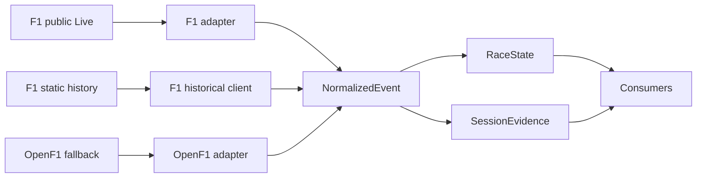
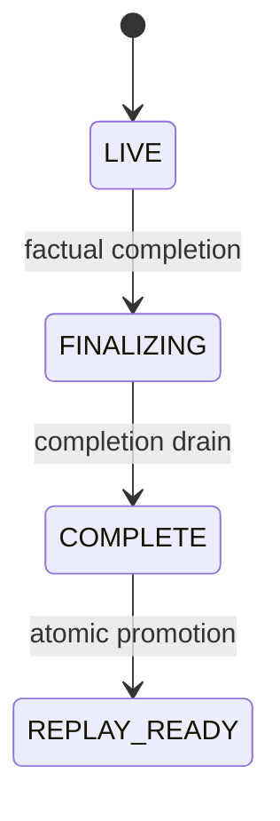
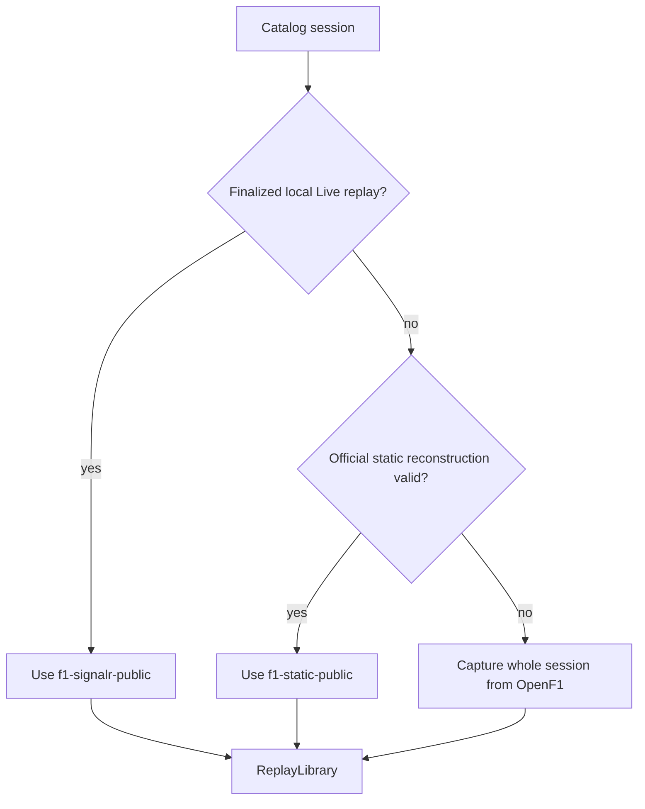
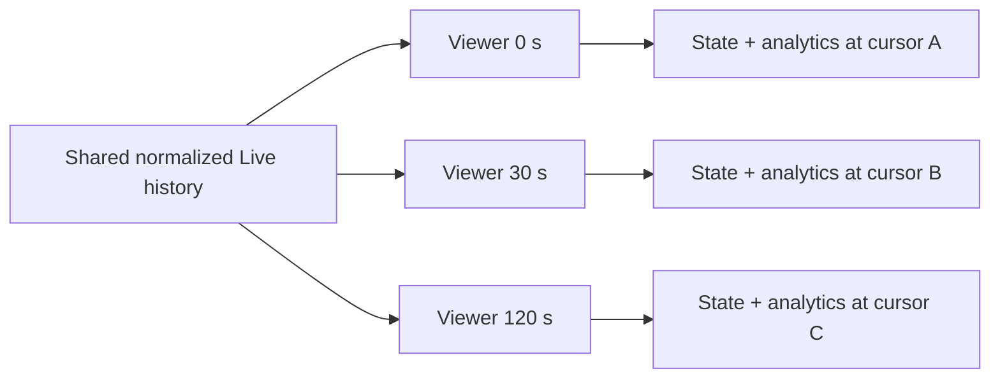
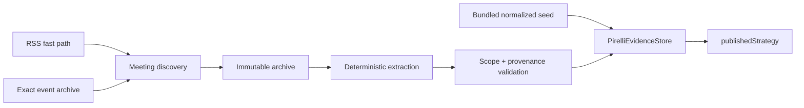

# Data flows and source precedence

This guide explains where Slipstream data comes from, how Live differs from Replay, how one timing source is selected, and where evidence and Pirelli context enter the product. The normative wire contract remains [protocol.md](protocol.md).

## Canonical source boundary

Slipstream has no provider-specific frontend.



A downstream consumer receives canonical contracts and does not reinterpret SignalR, `.jsonStream`, or OpenF1 response fields.

## Live path

```text
F1 public SignalR
    ↓
PublicLiveSession
    ↓
F1LiveAdapter
    ↓
shared NormalizedEvent history
    ├──→ current RaceState
    ├──→ current SessionEvidence
    ├──→ cursor-safe AnalyticsSnapshot
    └──→ normalized in-progress recording
```

The server owns one upstream Live connection. The allow-list contains low-volume session/timing/control/weather topics plus `Heartbeat`, `TopThree`, and `PitLaneTimeCollection`; a subscribed stream becomes product truth only where the adapter maps it to normalized events. Protected GPS, full telemetry, and team radio are not requested.

### Live finalization



Late canonical result events extend the drain. Heartbeats and source rows that emit no canonical fact do not. The finalized normalized recording—not optional raw SignalR evidence—is the product replay artifact.

## Historical timing path



ReplayLibrary selects one complete local timing artifact by declared source priority:

```text
finalized normalized Live
  > official F1 static reconstruction
  > OpenF1 whole-session fallback
```

Browser/API download attempts official static first and falls back to OpenF1 only when official reconstruction fails. Direct `slipstream fetch`, `fetch-weekend`, and `fetch-season` commands always mean OpenF1 capture.

### No field-by-field timing blend

Slipstream does not assemble one timing replay from arbitrary provider fragments. Catalog/circuit metadata and Pirelli are separately scoped context, but driver/session timing ownership is whole-session and recorded in the source manifest.

## Official F1 static timebase

The outer prefix on F1 `.jsonStream` rows is provider SessionTime. It cannot be interpreted as:

```text
scheduled session start + stream prefix
```

`F1HistoricalClient` extracts UTC anchors from `ExtrapolatedClock` and timestamped `SessionData` entries. Each candidate implies a stream-zero UTC value:

```text
candidate_stream_zero = provider_utc - session_time_offset
```

Reconstruction chooses the median of the best 10 ms cluster only when it contains at least two candidates and at least 75% of all candidates. Missing or inconsistent anchors fail the official source closed. The downloader then captures one complete OpenF1 fallback rather than splicing fields.

## Shared F1 timing semantics

SignalR and the official static archive have different transports but use the same F1 timing normalizer for facts such as:

- current position, lap, gap, and interval;
- last/best lap and sectors;
- tyre, stint, usage, and pit count;
- `IN_PIT`, `STOPPED`, and current Retired indication;
- qualifying timing and result facts;
- timing-derived progress where the selected historical source declares that capability.

Current source condition is separate from final classification. `STOPPED` and `RETIRED_INDICATED` can recover on explicit provider evidence; final `FINISHED`, `DNF`, `DNS`, `DSQ`, or authoritative `RETIRED` is terminal and cursor-bound.

## Replay cursor

Replay is reconstruction, not stored UI snapshots.

```text
immutable normalized events
      ↓
private ReplayController cursor
      ↓
reset + apply events through inclusive cursor
      ↓
RaceState(cursor) + SessionEvidence(cursor) + AnalyticsSnapshot(cursor)
```

Seeking backward makes future laps, pit events, lifecycle results, and analytics physically unreachable.

## Live delay

Live delay is a private cursor over the shared normalized Live history; it never switches to an historical provider.



The WebSocket protocol accepts 0–300 seconds. The current browser offers 0/5/10/15/30-second presets. Reset/Live returns only that viewer to zero. State, lifecycle, evidence, map eligibility, analytics sequence, and envelope playhead are all derived from the same inclusive delayed cursor.

## Evidence layer

`RaceState` answers what is true now. `SessionEvidence` answers what source-neutral history is known by this cursor.

Evidence includes completed laps, sectors, stint/compound assignments, qualifying phase/usage, pit events, compound transitions, and quality/contamination reasons. Driver history is requested on demand rather than included in every high-frequency state snapshot.

## Pit timing

`PitLaneTimeCollection.Duration` is complete lane transit:

```text
pit_lane_duration
```

It is not stationary pit-box time (`stop_duration`) and does not satisfy Net Pit Loss. Only values in `0 < duration <= 300 seconds` are admitted. Out-of-domain suspension-spanning values remain unavailable rather than being clamped. Missing duration never removes the factual pit event.

## Track position

Circuit geometry and car position are independent capabilities.

- catalog geometry supplies a durable exact outline;
- official static/OpenF1 historical timing can support approximate progress when declared;
- optional OpenF1 `--include-location` captures source X/Y separately;
- public Live currently declares `positionMode: unavailable` because the default slice has no supported car-position product capability.

Stopped, retired-indicated, and final-out cars are not left frozen as circulating markers. A transient `IN_PIT` car may be omitted from markers, but it is not an `OUT / STOPPED` label.

## Pirelli path

Pirelli is a low-frequency sidecar, not part of timing precedence.



Startup validates and idempotently imports the normalized distribution seed; it does not scrape the ten-season horizon. Quiet historical self-backfill and current/near-weekend runtime refresh use the same ingestion core. The fixed Pirelli horizon is independent of the replay catalog, and browser code never fetches Pirelli directly.

Strict evidence proves every artifact version existed by the replay cutoff and may be model-admissible. The fallback display-only official historical tier requires an approved Pirelli host, correct scope, and known pre-cutoff publication time; it is labelled and cannot create model-comparable options or windows.

## Storage and deletion

```text
/data
|-- catalog.json and replay artifacts
`-- .slipstream
    |-- sources/
    |-- raw-timing/
    |-- weekend-context/
    `-- pirelli/
```

Deleting one replay removes its canonical/raw timing, in-progress timing where applicable, raw timing cache, and rebuildable Weekend Context. It preserves catalog/circuit metadata, immutable Pirelli evidence, and the source manifest. The session remains visible and redownloadable.

## Capability summary

| Capability | Public Live | Official static | OpenF1 fallback/CLI |
| --- | --- | --- | --- |
| Timing/laps/sectors | Yes | Yes | Yes |
| Tyres/stints | Yes | Yes | Yes |
| Current F1 source condition | Yes | Yes | Source-dependent |
| Pit-lane duration | When published | When published | When supplied and valid |
| Race control/weather | Yes | Yes | Yes |
| Timing-derived car placement | Product mode unavailable | When reconstructed and declared | When reconstructed and declared |
| Source X/Y | No | No | Optional CLI location capture |
| Final classification | At factual settlement | At factual settlement | From session result evidence |
| Pirelli strategy | Separate sidecar | Separate sidecar | Separate sidecar |

## Fallback philosophy

A fallback preserves coherence rather than maximizing filled cells. If official timing cannot reconstruct one valid session, Slipstream chooses a complete OpenF1 session. If Pirelli evidence cannot meet a tier, it remains absent for that tier. If car position is unsupported, the circuit outline remains without fabricated markers.
