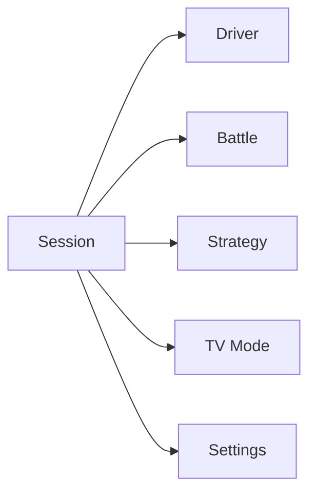
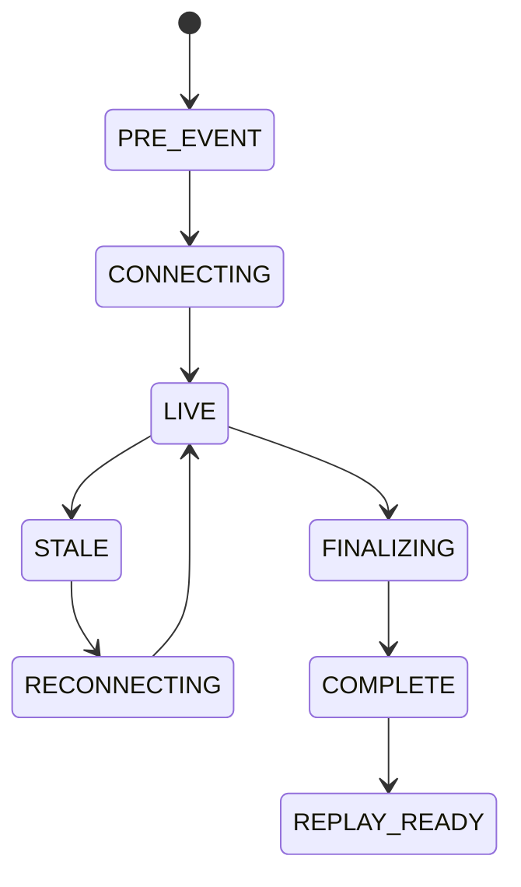

# Product and session flows

This guide describes how the browser experience changes by session family and by Live/Replay mode. It is not a second data contract: `RaceState`, `SessionEvidence`, and `AnalyticsSnapshot` remain authoritative.

## Navigation and availability



Availability is session-aware:

- Race and Sprint can expose Strategy and Battle;
- Qualifying and Sprint Qualifying use qualifying-specific Timing and Driver Focus;
- Practice emphasizes timing, run, driver, condition, and race-control evidence;
- TV Mode uses the same canonical contracts in an authored large-screen composition.

## Session selection

```text
season
  ↓
weekend
  ↓
session
  ↓
Live when the selected active session is supported
or Replay when a local recording exists
or Download when the finished session is not local
```

A valid current selection is preserved where possible. A same-session Live viewer stays on that session through `FINALIZING → REPLAY_READY`; a later Live session can be offered without forcibly moving the viewer.

## Live flow



Live controls are limited to viewer synchronization delay and return to Live/current state. Live does not expose replay pause, historical seek, step, or speed semantics.

## Replay flow

A replay viewer owns a private controller and can:

- play or pause;
- choose playback speed;
- scrub or seek to an inclusive time/sequence;
- move by relative seconds;
- reach the settled factual result boundary;
- reset to session start.

Seeking reconstructs state, evidence, and analytics from normalized events rather than mutating shared truth.

## Session-kind to layout mapping

| Factual session kind | Layout family |
| --- | --- |
| Practice 1/2/3 | Practice |
| Qualifying | Qualifying |
| Sprint Qualifying | Qualifying |
| Sprint | Race |
| Race/Grand Prix | Race |

Layout reuse does not change factual session kind or sporting policy.

## Race and Sprint

### Session

The Race layout combines Timing Tower, Track Map, weather, race control, governing status, current tyre/stint/pit facts, and compact race-level Pirelli tyre strategies. Timing Tower content modes can change presentation without changing the underlying driver state; Strategy mode shows each driver's factual stop-preserving tyre sequence and last actual stop.

### Driver

Driver Focus combines current factual stint, ahead/behind context, lifecycle-aware Track Map, clean-stint pace trend, factual Pit History, and attributed Pirelli context when available. It presents the actual tyre strategy first, the Pirelli reference second, and the dry-tyre requirement only when the server can author it truthfully.

A pit row can contain:

```text
STOP | LAP | previous compound → new compound | STATIONARY | PIT LANE
```

`STATIONARY` appears only when separately defensible `stopDuration` exists. `PIT LANE` is complete lane transit. If an entire duration type is absent, the column is omitted; individual missing values inside a supported column render `—`.

### Strategy

Strategy combines two independently useful areas:

1. official Pirelli pre-race context with explicit provenance/evidence tier;
2. current-race factual RaceRead.

RaceRead remains useful when Pirelli is absent. Display-only Pirelli context cannot silently become model evidence.

### Battle

Battle is server-authored from factual and derived completed-lap evidence. React renders the two drivers' actual tyre strategies, selected/recommended pair, score factors, histories, and factual map context without recalculating timing truth; Pirelli remains secondary reference context.

## Qualifying and Sprint Qualifying


The timing surface distinguishes phase, segment results, benchmark/gap, tyre/age, sectors, advancement boundary, and final qualifying status. The server uses stable roster and explicit season/field-size policy; the number of currently visible timing rows does not redefine advancement.

A driver can be physically `STOPPED` while a previously set lap still advances them. Slipstream therefore never equates stopped/crashed with `OUT Q1/Q2`. Current source condition and qualifying result are separate facts.

Cars in pit may be omitted from physical markers when position is not meaningful, but transient `IN_PIT` never floods `OUT / STOPPED`.

## Practice

Practice emphasizes:

- run classification and last/best lap;
- tyre, age, stint, and factual pit evidence;
- Track Map where historical position capability exists;
- weather/conditions and race control.

Practice has no meaningful race-style total-lap denominator and does not invent a final DNF model. Its layout gives the Track Map a real desktop body while preserving usable Conditions and Race Control.

## Driver history

Driver history is loaded on demand through `/api/v1/driver-history`; it is not retransmitted inside every state snapshot. The browser filters history to the current replay cursor.

## TV Mode

TV Mode is a large-screen rendering of the same server contracts. The authored state set is explicit:

| Layout | TV states |
| --- | --- |
| Race | Tower, Track, Strategy, Battle, Driver, filtered by device preferences |
| Qualifying | Tower; Track only when circuit and car positions are renderable |
| Practice | Tower only |

Auto rotation advances only through the authored states available for that session. TV Mode does not own separate timing, lifecycle, or analytics truth.

## Track lifecycle presentation

```text
RUNNING + declared position evidence
    → marker on circuit

IN_PIT
    → marker may be omitted when physical position is not meaningful
    → never OUT / STOPPED

STOPPED
    → remove stale circulating marker
    → factual STOPPED label

RETIRED_INDICATED
    → remove stale marker
    → current RETIRED indication

final FINISHED / DNF / DNS / DSQ / authoritative RETIRED
    → no circulating marker
    → final classification label
```

A recovered `STOPPED` or `RETIRED_INDICATED` source condition can return to current running semantics when explicit provider evidence retracts it; terminal classification cannot.

## Missing-data behavior

Capability-wide absence and row-level absence are different:

- capability absent: omit the whole field, column, or module where appropriate;
- individual value absent inside a supported capability: retain structure and render `—`.

Internal availability enums are diagnostics/contracts, not noisy default product copy.

## Visual-design boundary

Visual design may change panel proportions, responsive composition, density, hierarchy, typography, Pit History row layout, and TV composition. It must not silently change provider truth, lifecycle meaning, source precedence, evidence cutoffs, session policy, or analytics formulas.
