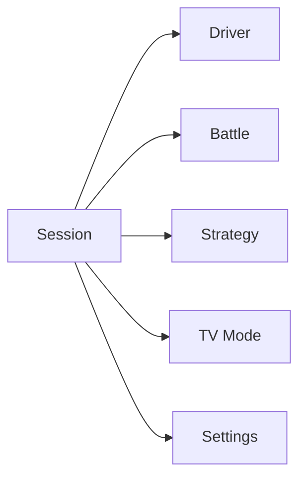
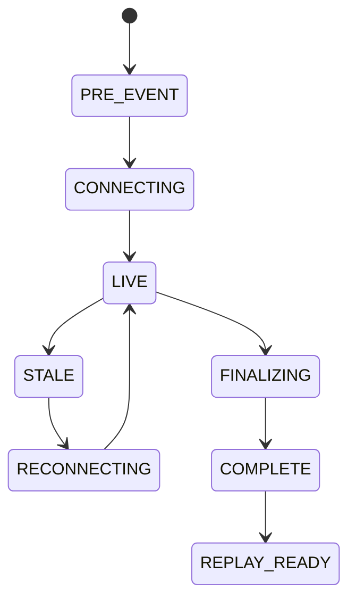
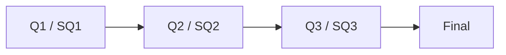

# Product and session flows

This guide describes how the browser experience changes by session family and by Live/Replay mode. It is not a second data contract: `RaceState`, `SessionEvidence`, and `AnalyticsSnapshot` remain authoritative.

## Navigation and availability


```mermaid
flowchart LR
    Session[Session] --> Driver[Driver]
    Session --> Battle[Battle]
    Session --> Strategy[Strategy]
    Session --> TV[TV Mode]
    Session --> Settings[Settings]
```

Availability is session-aware:

- Race and Sprint can expose Strategy and Battle;
- Qualifying and Sprint Qualifying use qualifying-specific Timing and Driver Focus;
- Practice emphasizes timing, run, driver, condition, and race-control evidence;
- TV Mode uses the same canonical contracts in an authored large-screen composition.

Session, Driver, Battle, and TV are presentations of one viewer controller. Changing presentation preserves confirmed cursor, mode, speed, play/pause state, live delay, and a pending moment-return point. Device preferences retain appearance, selected driver, tower modes, pane widths, and TV settings.

## Session selection

```text
season
  ↓
weekend
  ↓
session
  ↓
Live when the selected active session is supported
or Replay when a local recording exists
or Download when the finished session is not local
```

A valid current selection is preserved where possible. A same-session Live viewer stays on that session through `FINALIZING → REPLAY_READY`; a later Live session can be offered without forcibly moving the viewer.

## Live flow


```mermaid
stateDiagram-v2
    [*] --> PRE_EVENT
    PRE_EVENT --> CONNECTING
    CONNECTING --> LIVE
    LIVE --> STALE
    STALE --> RECONNECTING
    RECONNECTING --> LIVE
    LIVE --> FINALIZING
    FINALIZING --> COMPLETE
    COMPLETE --> REPLAY_READY
```

Live supports private pause/resume, synchronization delay, and GO LIVE. Pause holds the viewer's source cursor while delay grows with source progress. At five minutes the viewer resumes at that delay and explains why. Resume runs at 1×; GO LIVE returns to zero delay. A requested delay longer than available history is shown separately from the effective delay. Stale/reconnecting source state freezes timing and does not create new sporting events. Historical seek, step, and variable speed belong to Replay.

## Replay flow

A replay viewer owns a private controller and can:

- play or pause;
- choose playback speed;
- scrub or seek to an inclusive time/sequence;
- move by relative seconds;
- reach the settled factual result boundary;
- reset to session start.

Seeking reconstructs state, evidence, and analytics from normalized events rather than mutating shared truth.

Activity offers Replay This Moment in Replay mode. It saves the current cursor, playhead, speed, and play/pause state before jumping to the event; Return restores those values. Replaying another moment retains the original return point. Seeking, reconnecting, changing delay, and returning rebuild presentation state without animating an old story as newly received action.

## Activity and story

Activity uses one server-authored story ledger across desktop, phone, and TV. Each item records when the event happened and when the evidence made it knowable. An order change starts as a neutral observation; only later corroborating evidence can confirm a pass. Pit-related changes, stopped cars, late classifications, missing laps, and neutralized running do not become invented overtakes. Result and correction items appear only when their evidence reaches the viewer cursor. Opening or seeking into a session shows the known history quietly; recent-action treatments apply only to newly available events during continuous forward viewing. See [story.md](story.md) for the contract and causal rules.

## Session-kind to layout mapping

| Factual session kind | Layout family |
| --- | --- |
| Practice 1/2/3 | Practice |
| Qualifying | Qualifying |
| Sprint Qualifying | Qualifying |
| Sprint | Race |
| Race/Grand Prix | Race |

Layout reuse does not change factual session kind or sporting policy.

## Race and Sprint

### Session

The Race layout combines Timing Tower, Track Map, weather, race control, governing status, current tyre/stint/pit facts, Activity, and compact race-level Pirelli tyre strategies. The draggable split offers Balanced (50% timing), Tower Wide (62%), and Analysis Wide (40%). Brief, Map, and Story analysis presets change emphasis, while modules remain independently resizable, reorderable, and hideable. Timing Tower content modes can change presentation without changing the underlying driver state; Strategy mode shows each driver's factual stop-preserving tyre sequence and last actual stop. Narrow panes prioritize columns, report hidden fields, and reveal details by expanding a driver row.

### Driver

Driver Focus combines current factual stint, ahead/behind context, lifecycle-aware Track Map, clean-stint pace trend, factual Pit History, and attributed Pirelli context when available. It presents the actual tyre strategy first, the Pirelli reference second, and the dry-tyre requirement only when the server can author it truthfully.

A pit row can contain:

```text
STOP | LAP | previous compound → new compound | STATIONARY | PIT LANE
```

`STATIONARY` appears only when separately defensible `stopDuration` exists. `PIT LANE` is complete lane transit. If an entire duration type is absent, the column is omitted; individual missing values inside a supported column render `—`.

Completed stops require completed normalized pit events. A provider pit-counter increment at entry does not finish a stop, and an unknown new compound stays unknown until that stop has explicit evidence.

### Strategy

Strategy combines two independently useful areas:

1. official Pirelli pre-race context with explicit provenance/evidence tier;
2. current-race factual RaceRead.

RaceRead remains useful when Pirelli is absent. Display-only Pirelli context cannot silently become model evidence.

### Battle

Battle is server-authored from factual and derived completed-lap evidence. React renders the two drivers' actual tyre strategies, selected/recommended pair, score factors, histories, and factual map context without recalculating timing truth; Pirelli remains secondary reference context. Recommendations require RUNNING/GREEN race lap 3 or later, both drivers on track on known equal laps, and stable eligible source history. A manual nonadjacent pair uses the server's comparable numeric gap or an explicit unavailable reason; the browser never subtracts displayed leader gaps.

## Qualifying and Sprint Qualifying


```mermaid
flowchart LR
    Q1[Q1 / SQ1] --> Q2[Q2 / SQ2] --> Q3[Q3 / SQ3] --> Final[Final]
```

The timing surface distinguishes phase, segment results, benchmark/gap, tyre/age, sectors, advancement boundary, and final qualifying status. The server uses stable roster and explicit season/field-size policy; the number of currently visible timing rows does not redefine advancement.

A segment flag enters a settling state while flying laps can still change the order. Explicit whole-session completion ends that settling period, but classification remains labelled provisional without separate final evidence. Current advancement position is not presented as final elimination.

A driver can be physically `STOPPED` while a previously set lap still advances them. Slipstream therefore never equates stopped/crashed with `OUT Q1/Q2`. Current source condition and qualifying result are separate facts.

Cars in pit may be omitted from physical markers when position is not meaningful, but transient `IN_PIT` never floods `OUT / STOPPED`.

## Practice

Practice emphasizes:

- run classification and last/best lap;
- tyre, age, stint, and factual pit evidence;
- Track Map where historical position capability exists;
- weather/conditions and race control.

Practice has no meaningful race-style total-lap denominator and does not invent a final DNF model. Its layout gives the Track Map a real desktop body while preserving usable Conditions and Race Control.

## Driver history

Driver history is loaded on demand through `/api/v1/driver-history`; it is not retransmitted inside every state snapshot. The browser filters history to the current replay cursor.

## Phone and display preferences

Phone layouts use session-specific tabs: Race Timing/Track/Strategy/Activity; Qualifying Timing/Cutline/Track/Activity; Practice Timing/Runs/Track/Activity. Selecting a timing row opens its expanded facts and Driver Focus path. Transport remains available without occupying the whole screen, with advanced controls in an accessible disclosure.

Display scale defaults to 80%, with 75%, 80%, 90%, and 100% device choices. Root typography and spacing follow that setting, and reduced-motion preference suppresses decorative transitions. Qualifying and Practice have independent draggable desktop pane widths.

## TV Mode

TV Mode is a large-screen rendering of the same server contracts. The authored state set is explicit:

| Layout | TV states |
| --- | --- |
| Race | Track, Strategy, Battle, Driver, and post-flag Result, filtered by device preferences; Timing is a manual feature |
| Qualifying | Tower; Track only when circuit and car positions are renderable |
| Practice | Tower only |

Auto rotation advances only through eligible available features. A compact timing rail remains alongside the Race feature; expanded Timing is selected manually. Result remains unavailable until result evidence reaches the viewer cursor and is labelled provisional unless finality is explicitly known. TV Mode shares the standard viewer's timing, lifecycle, analytics, delay, play/pause, and moment-return state.

TV has viewport-based scaling, text-size and safe-area controls, visible feature availability reasons, Follow, Activity, and Playback/Sync panels. Keyboard and remote controls use the same command guards as on-screen buttons. The sync panel exposes bounded live delay or Replay playback controls according to mode.

## Track lifecycle presentation

```text
RUNNING + declared position evidence
    → marker on circuit

IN_PIT
    → marker may be omitted when physical position is not meaningful
    → never OUT / STOPPED

STOPPED
    → remove stale circulating marker
    → factual STOPPED label

RETIRED_INDICATED
    → remove stale marker
    → current RETIRED indication

final FINISHED / DNF / DNS / DSQ / authoritative RETIRED
    → no circulating marker
    → final classification label
```

A recovered `STOPPED` or `RETIRED_INDICATED` source condition can return to current running semantics when explicit provider evidence retracts it; terminal classification cannot.

## Missing-data behavior

Capability-wide absence and row-level absence are different:

- capability absent: omit the whole field, column, or module where appropriate;
- individual value absent inside a supported capability: retain structure and render `—`.

Internal availability enums are diagnostics/contracts, not noisy default product copy.

## Visual-design boundary

Visual design may change panel proportions, responsive composition, density, hierarchy, typography, Pit History row layout, and TV composition. It must not silently change provider truth, lifecycle meaning, source precedence, evidence cutoffs, session policy, or analytics formulas.
