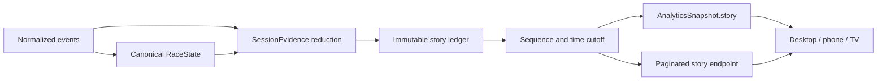

# Session story: evidence, publication, and presentation

The session story is a deterministic server interpretation of normalized timing evidence. It gives the viewer an understandable account of what changed, while preserving the distinction between an observation, a corroborated pass, and a provisional result. It is shared by the desktop Activity panel, phone Activity tab, and TV ticker and moments.

This is the implementation contract for `causal-story-v1` in `src/slipstream/story.py`. It complements [Analytics](analytics.md), [Protocol](protocol.md), and [Session experience](session-experience.md). The HTML design prototype establishes visual intent; its browser-side engine is not a data source for production.

## Ownership and data flow

`SessionEvidence.reduce_events` accumulates story evidence in the same preparation pass as lap and pit evidence. `SessionEvidence.append` performs the same reduction for new live events. A story is not calculated from the order in which HTTP requests arrive, from browser animation state, or from an LLM. Browser code chooses filters and presentation; it does not infer an overtake, tyre change, elimination, penalty effect, or winner.

The ledger stores immutable observations outside `RaceState`. Preparing a complete recording may build its entire ledger, but every response applies both the requested event-count cursor and source-time cutoff. Full accumulated history is not copied into each factual state snapshot. Analytics includes the latest 80 visible events; recorded history has a separate bounded endpoint.

## Event contract

| Field | Meaning |
| --- | --- |
| `id` | Deterministic hash of session, normalized evidence fingerprint, event kind, and involved drivers. Unrelated sequence insertion does not rename an existing event. |
| `sessionKey` | Session that owns the event. |
| `kind` | Server-authored event category. |
| `occurredAt` | Time of the underlying observation or occurrence. |
| `availableAt` | Source time at which the evidence needed for this story became available. For a pass, this is the confirming update, not the earlier inversion. |
| `availableSequence` | Inclusive normalized-event sequence required to publish the event, including ordering within a shared timestamp. |
| `state` | `provisional`, `confirmed`, or `corrected`; this describes the story claim, not final sporting classification. |
| `supersedes` | Earlier event replaced by this later observation. Replacement applies only once the replacement is itself available. |
| `driverNumbers` | Source identifiers for the involved drivers. Empty when no driver attribution is supported. |
| `cause` | Supported context such as `PIT`, `ON_TRACK`, `CLASSIFICATION`, or an official status. Missing cause is `null`. |
| `lap`, `phase` | Race lap or known qualifying segment at publication. These are contextual stamps; detailed lap messages may name an earlier completed lap. |
| `priority` | 1 for ordinary history, 2 for highlights, 3 for major moments. |
| `title`, `detail` | Wording generated by deterministic templates or the verbatim normalized race-control message. |
| `evidence` | Normalized sequences, observation times, and field names supporting the claim. |
| `data` | Small event-specific facts, such as observed compound or position. Missing evidence remains null or absent. |

`availableAt` uses the canonical source timeline. It is not a promise about a particular viewer's network receipt time. Transport latency, late source corrections, and provider normalization remain separate concerns. `availableSequence` prevents equal-timestamp partial cursors from seeing later events.

The snapshot carries `modelVersion`, `sequence`, `asOf`, a visible-ledger `revision`, `events`, `total`, `hasMore`, `nextOffset`, and a result summary. A result summary is `none` or `provisional` in v1. The protocol reserves `final`, but this model never invents official finality from file completion, a chequered flag, or a position array.

## Order changes and passes

1. The server observes a coherent classification: positioned drivers must have unique positions. The previous and new orders must contain the same driver set.
2. From race lap 2, an inversion produces a neutral `ORDER_CHANGE`: for example, “HAM moves ahead of LIN.” This is immediately useful factual history without declaring an on-track overtake.
3. Pit entry/exit evidence within the recent 45-second context, an active pit state, or final classification can explain the change. Pit context is labelled as a pit-related order change. An unexplained inversion remains provisional.
4. Only an unexplained change in a running race, from lap 3, in known green conditions, between running on-track cars on the same known lap can become a pass candidate.
5. At least five source seconds must elapse. Both cars must then supply a fresh timing update containing position, lap, track progress, or completed-lap evidence while the changed order still holds.
6. Only then is `PASS` published. Its `occurredAt` retains the original inversion; `availableAt` and `availableSequence` identify confirmation. It supersedes the neutral observation at that cursor.

Yellow, VSC, Safety Car, red/suspended running, a pit transition, an incompatible lifecycle/lap state, or a reversal cancels a pending candidate. Silence never confirms a pass. A candidate without sufficient evidence expires after 30 source seconds.

This is deliberately conservative. Cars crossing the start/finish line on separate packets can temporarily have different lap counts; a genuine pass can therefore remain a neutral order observation. The model prefers missing an inferred pass to asserting one without adequate evidence. It does not claim racing-line telemetry, driver intent, legality, or the exact physical instant of an overtake.

## Other event rules

| Category | Evidence and wording |
| --- | --- |
| `PIT_IN` | A known running car becomes in-pit. Records entry position and previous compound only. Pre-start installation movements do not fill the race story. |
| `PIT_EXIT` | A known in-pit car resumes running. A new compound is included only if it was explicitly observed since entry or in a qualifying pit observation. Otherwise it says the compound is not yet confirmed. |
| `STOPPED` / `RUNNING` | A source-backed stop and later positive recovery. STOPPED is expressly not called retirement. |
| `RETIRED_INDICATED` | A current, retractable source retirement indication, labelled provisional. |
| `CLASSIFICATION` | Newly observed terminal classification such as DNF or DSQ. The story does not infer it from a gap or stationary map marker. |
| `LAP_IMPROVEMENT` | A completed-lap observation improves the driver's previously known best, or the known field benchmark. An explicitly invalid lap is excluded. Unknown validity is not converted into official validity. |
| `LAP_DELETED` / `PENALTY` | A corresponding official race-control message. The message is preserved; no penalty arithmetic or resulting position is invented. |
| `RACE_CONTROL` | Other normalized official messages, deduplicated by message and timestamp. |
| `FLAG` | A change in the server's effective display status. Sector messages remain race-control evidence and do not themselves establish an official session restart. |
| `RESTART` | Canonical sporting status changes from suspended to running. Marshal green alone is insufficient. |
| `PHASE` | A known qualifying segment changes to another known segment. |
| `SESSION_END` | A timed-session flag, explicitly provisional because laps already underway may still finish. |
| `WEATHER` | Rain sensor changes. The story does not infer grip, a wet circuit, or tyre suitability. |
| `BATTLE` | Three consecutive completed laps with a sourced interval no greater than one second between an eligible same-lap pair during green running. Caution resets the run. This is an observation at that lap, not a continuing recommendation. |
| `RESULT` | Exactly one driver is P1, that driver has a FINISHED classification, and the race has a chequered/finished state. Duplicate P1 packets do not establish a winner. “Wins on the road” remains provisional. |
| `RESULT_CORRECTION` | A later classification puts another finished car in P1. The updated provisional result supersedes the earlier result only at the new evidence cursor. |

The Activity battle threshold is intentionally different from the broader analytics Battle recommendation score. A completed-lap one-second story describes sustained proximity; the scored recommendation can consider eligible pairs within 12 seconds. Both are server-authored, and both suppress racing interpretations during caution.

Pit lane traversal is not proof of a stationary tyre stop. A later compound observation can update current canonical tyre state without rewriting the earlier pit-exit story. Repeated compounds are retained in factual actual-strategy history. Stationary stop duration, pit-lane transit, and Net Pit Loss remain different concepts.

## Qualifying and results

The story never promotes the current top-N boundary to a guaranteed advancement result. Explicit source elimination is distinct from being currently below the cut. Qualifying analytics provides `cutLabel` (`ABOVE CUT`, `BELOW CUT`, `ELIMINATED`, `UNKNOWN`) and `settlement` (`RUNNING`, `SETTLING`, `SOURCE_COMPLETE`).

The legacy qualifying `final` boolean identifies the final segment's flag; it is not sufficient for a FINAL or POLE claim. At the flag, the UI says laps are finishing. Explicit source completion can settle the session, while the classification remains labelled provisional. V1 has no inferred quiet-period finalization, predictive qualifying safety, or automatically inferred pole story.

## Replay and navigation

Inspection expands an event's occurrence time, publication time, state, and supported context. Inspection never seeks. “Replay this moment” is a separate replay-only action.

The hook saves the exact sequence, playhead, speed, play/pause state, and viewer delay before replaying a moment at 1×. The return action restores the saved sequence and fractional playhead; the server verifies the clock belongs to that sequence. An equal-timestamp return therefore cannot accidentally include another event. A second inspected moment keeps the original return point until it is used or the session changes.

Live has no historical seek. The feed explains that moments become replayable once a recording exists. Live pause is a private bounded viewer delay, described in [Session experience](session-experience.md), and does not turn Live into recorded replay.

Seek, reset, changed delay, session/mode change, reconnect, and limit-induced live movement advance the navigation generation. Feed remounts and TV moments rebuild silently at the new cursor. First mount is also silent. Merely opening a previously hidden Activity surface must not replay its historical entrance animations.

During ordinary forward viewing, new events may animate. If a reader has scrolled into history, the feed preserves their reading position and presents a new-items button. Everything, Highlights, and Following are presentation filters; they do not change the underlying ledger. Pagination is for recorded history and uses the recording identity to reject a replaced recording's sequence.

## TV and reduced motion

TV keeps timing visible while the analysis area presents major moments. The ticker preserves recent history; its Activity view supports inspection and replay. A moment holds for five wall-clock seconds at ordinary speed and 2.2 seconds from 5×. Faster arrivals replace pending content instead of forming a stale queue. At 20× and above only results and red flags receive takeovers. Seek/reconnect rebuilds never count as fresh news.

Reduced motion removes entrance transforms and timing-row travel. Facts, labels, hierarchy, and readable hold time remain. Device motion and density preferences apply across desktop, phone, and TV. Density uses layout tokens, not CSS `zoom`.

## Validation and known limits

Automated tests cover confirmation timing, both-car corroboration, equal-timestamp sequence gates, caution cancellation, future-compound isolation, STOPPED recovery, result correction, stable event identity, pagination, incremental/full reduction parity, silent navigation, separate inspect/replay actions, and fast-playback suppression.

The real Hungarian recording was also checked at 0, 743, 1179, 1184, 2400, 3450, 4766, 4830, and 6150 seconds after the observed race start (13:03:18.360 UTC). At each cursor, canonical state, the complete Story snapshot, and analytics from the full 105,307-event recording matched a separately reduced physically truncated prefix. The read-only [recording validator](../tools/README.md#story-and-analytics-prefix-validation) reproduces this check. This tests future-evidence isolation; it does not prove every interpretation of the source is correct.

The same audit passed at seven cutoffs each for the 13,684-event Qualifying recording and the 16,607-event Practice recording (0 through 3600 seconds in 600-second steps). These exercise qualifying phase/attempt/teammate history and practice evidence alongside Story. The [documentation audit](../DOCUMENTATION_AUDIT.md#implementation-verification) records aggregate tests, browser checks, and delivery limits.

Known limits are explicit: no automatic official-final certification, no inferred qualifying pole or elimination, no penalty-position arithmetic, no inferred retirement from missing progress, no guaranteed detection of every genuine pass, and no invented explanation for an unexplained order change. Historical milestone reports retain their original scope.
